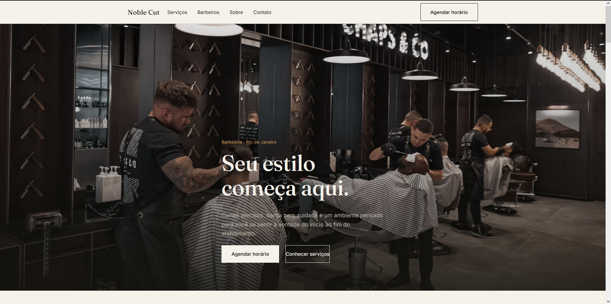
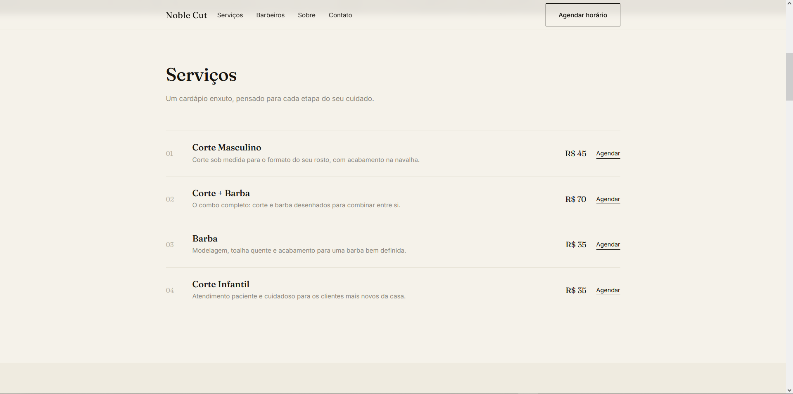
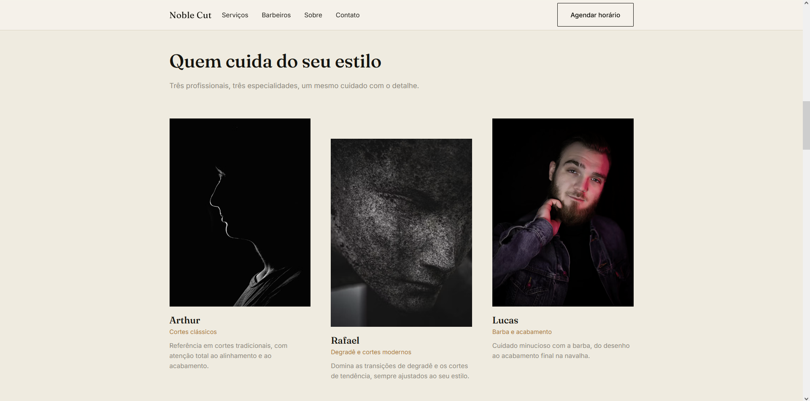

# Noble Cut

Website institucional e comercial para uma barbearia masculina fictícia no Rio de Janeiro, desenvolvido como projeto de portfólio.

**Noble Cut é uma marca fictícia criada exclusivamente para fins de demonstração e portfólio.**

---

## Sobre o projeto

Este é o segundo projeto de portfólio da série de websites para pequenos negócios. Diferente do primeiro projeto (Burger House), a Noble Cut adota uma linguagem visual editorial, sóbria e contemporânea — pensada para transmitir sofisticação e profissionalismo sem recorrer a clichês visuais do segmento (navalhas decorativas, estética vintage, excesso de dourado).

O objetivo é apresentar uma solução completa: identidade visual, estrutura de conteúdo, agendamento funcional e responsividade total, como se fosse entregue a um cliente real.

## 🖥️ Preview

### Página inicial



### Serviços



### Profissionais



🔗 **[Acessar o projeto online](https://mtdesenvolvedorweb.github.io/noble-cut/)**

---

## Funcionalidades

- Navbar fixa com menu mobile funcional (hambúrguer)
- Hero com hierarquia visual clara e imagem em destaque
- Seção de serviços em formato de lista editorial, com botão de agendamento individual
- Apresentação dos três barbeiros da equipe (fictícios)
- Seção "Sobre" com proposta de experiência do cliente
- Galeria visual do ambiente
- Formulário de agendamento que monta automaticamente uma mensagem para o WhatsApp, de acordo com o serviço, profissional e período escolhidos
- Avaliações fictícias de clientes
- Seção de localização com endereço, horário de funcionamento e link "Como chegar"
- Rodapé completo com navegação, horários, redes sociais e ano de copyright automático
- Animações sutis de entrada e hover, com suporte a `prefers-reduced-motion`

## Tecnologias

- HTML5 semântico
- CSS3 (sem frameworks — variáveis CSS, Grid e Flexbox)
- JavaScript vanilla (sem bibliotecas ou frameworks)
- Google Fonts (Fraunces + Inter)

## Design

A identidade visual segue uma linha editorial e contemporânea:

- **Paleta:** preto/grafite (`#15140F`) e off-white quente (`#F5F2EA`) como base, com cinza morno para textos secundários e bronze (`#A9793F`) usado apenas como detalhe pontual — nunca como cor dominante.
- **Tipografia:** Fraunces (serifada, para títulos) combinada com Inter (para textos), garantindo elegância sem prejudicar a legibilidade.
- **Layout:** composição assimétrica com bastante espaço negativo, listas editoriais no lugar de cards decorados, divisórias finas (hairline) e retratos em grid com leve desalinhamento vertical.
- Nenhum elemento decorativo (navalhas, bigodes, madeira, dourado em excesso) foi utilizado — a estética se apoia em fotografia, tipografia e espaçamento.

## Responsividade

O layout foi construído mobile-first nos pontos críticos e testado nos seguintes breakpoints:

- **Desktop** (acima de 980px): navegação completa, grids de 3 e 4 colunas
- **Tablet** (até 980px): menu hambúrguer, grids reduzidos a 2 colunas
- **Smartphone** (até 640px): colunas únicas, botões com área de toque ampliada, sem rolagem horizontal

## Agendamento

A seção "Agende seu horário" permite selecionar serviço, profissional e período por meio de botões. O JavaScript monta em tempo real uma mensagem de texto com as escolhas do usuário e a envia para o WhatsApp através do link `https://wa.me/`.

O número de WhatsApp utilizado é **fictício** e está isolado em uma constante no topo do arquivo `js/script.js` (`WHATSAPP_NUMBER`), facilmente editável para uso em um projeto real.

Os botões "Agendar" na seção de serviços também abrem o WhatsApp diretamente, já com o serviço correspondente preenchido na mensagem.

## Objetivo

Este projeto demonstra a capacidade de desenvolver websites comerciais completos para pequenos negócios — da concepção da identidade visual à implementação de uma funcionalidade de conversão (agendamento via WhatsApp) — utilizando apenas HTML, CSS e JavaScript puro, sem dependências externas de frontend.

## Estrutura de arquivos

```
noble-cut/
├── index.html
├── css/
│   └── style.css
├── js/
│   └── script.js
├── screenshots/
└── README.md
```

## Como executar

Não há build nem dependências. Basta abrir o arquivo `index.html` diretamente no navegador, ou servir a pasta com qualquer servidor estático, por exemplo:

```bash
npx serve .
```

ou, com Python:

```bash
python3 -m http.server
```

---

*As fotografias utilizadas neste projeto são de bancos de imagens gratuitos (Unsplash) e servem apenas para fins de demonstração visual.*
